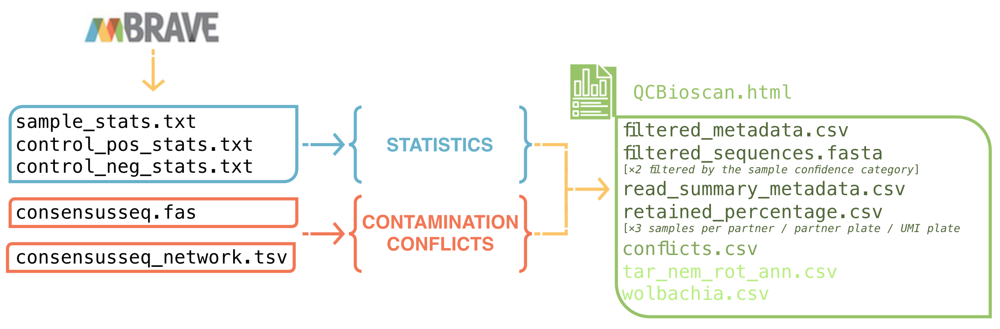
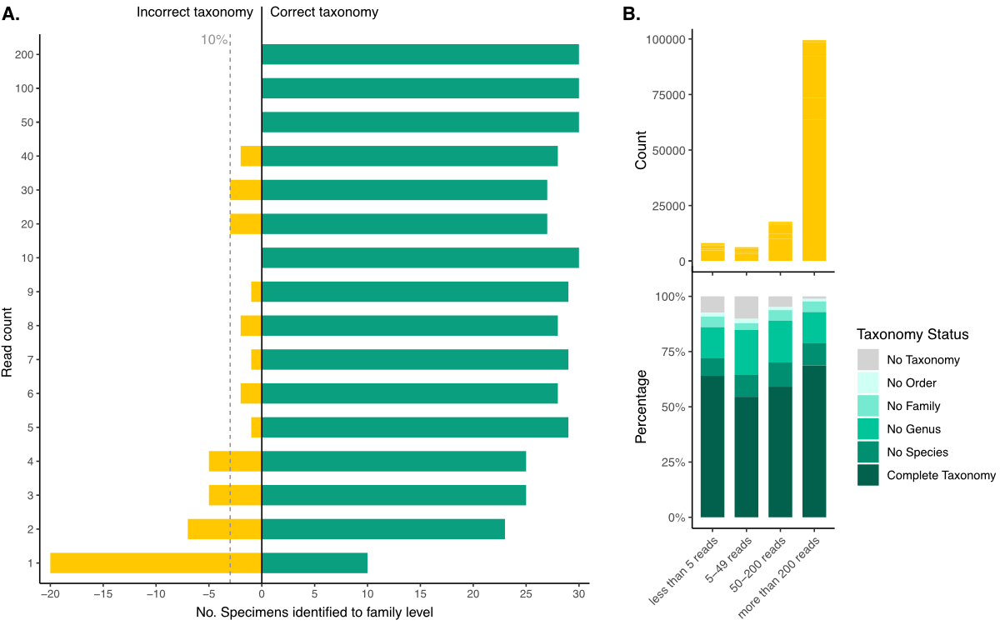
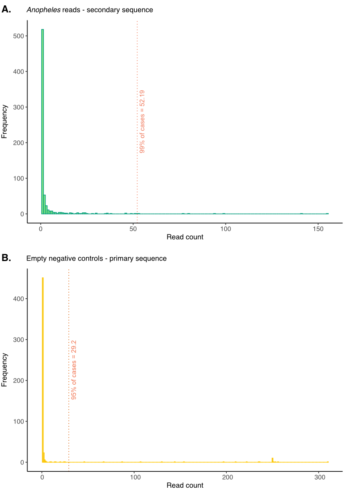
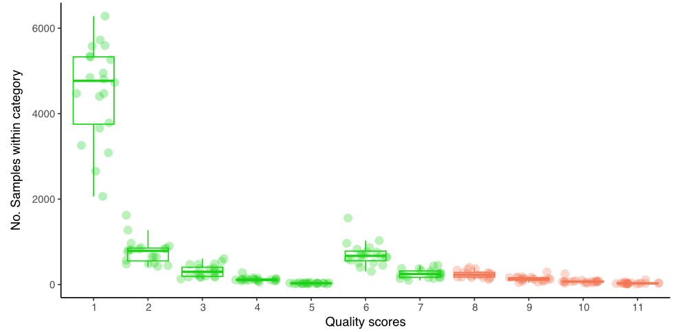
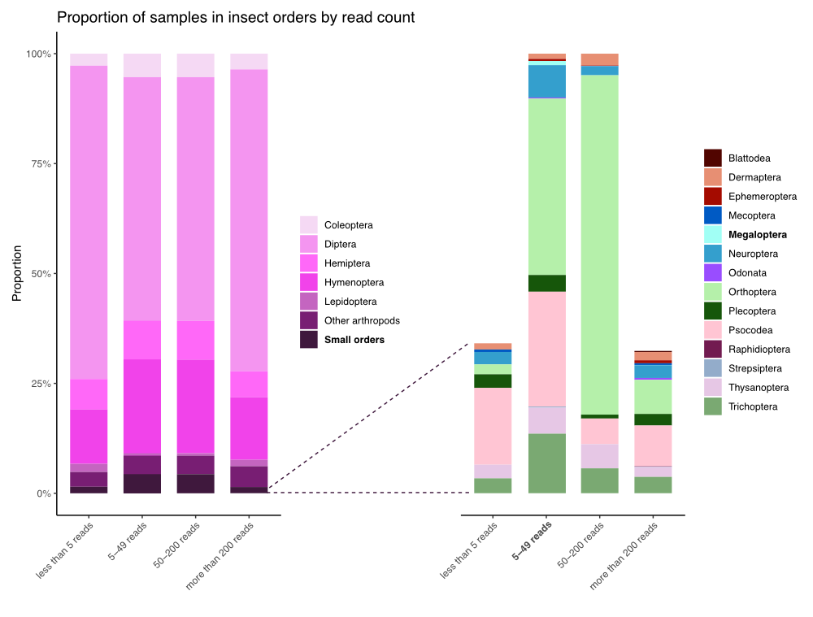

# BIOSCAN QC 
### Version 1.0 [November 2024]
<br><br>
This script generates a BIOSCAN QC report and filters one consensus sequence per sample using output files from mBRAVE. It is designed specifically for processing the Wellcome Sanger Institute BIOSCAN data. <br> <br> 
<p align="center">
  
</p>

## Installation
No installation is required when running this script on Farm.
## Usage
Submit an interactive job request:<br>
```bash
bsub -Is -n 4 -R "select[mem>2000] rusage[mem=2000] span[hosts=1]" -M 2000 -G team222 bash
```
Set the batch number [the batch number must match the name of the input data directory; replace X with a corresponding number]:<br>
```bash
batch="batchX"
```
Run the script:<br>
```bash
export batch_path="/nfs/users/nfs_a/aw43/aw43/2024_07_bioscan_qc/input/mbrave_batch_data/${batch}/"
export output_path="/nfs/users/nfs_a/aw43/aw43/2024_07_bioscan_qc/input/output/qc_reports/${batch}/"
export batch_no="${batch}"
module load HGI/softpack/users/aw43/aw43_bioscan-aw43_bioscan-4-aw43_bioscan-4/1
Rscript -e "rmarkdown::render(input = '/lustre/scratch126/tol/teams/lawniczak/users/aw43/2024_07_bioscan_qc/code/QCBioscan.Rmd', output_format = 'html_document', output_dir = Sys.getenv('output_path'))"
```
<br>
<p align="center">
  
</p>

## Glossary
<b>Partner plate</b>: 96-well plate used by BIOSCAN partners, with each well containing a single insect for individual analysis.   <br><br>
<b>UMI plate</b>: 384-well plate used for sample processing and PCR, with four partner plates transferred onto a single UMI plate.  <br><br>
<b>Positive controls</b>: well G12 of each 96-well partner plate containing XXXX sequence.  <br><br>
<b>Negative controls</b>: two negative control lypes are used in BIOSCAN. <b>Lysate controls:</b> well H12 and any wells left empty by the partners on partially empty plates; <b>Empty control:</b> one well per plate selected at random [insect automatically excluded].  <br><br>
<b>Sample</b>: each partner plate contains 93 samples - wells where insect specimens are plated and sequenced.  <br><br>
<b>Sequencing batch</b>: a single sequencing run, typically containing XXX partner plates.  <br><br>
<b>Primary sequence</b>: the sequence in a well with the highest read count and highest similarity score.   <br><br>
<b>Secondary sequence</b>: any sequences detected in a well other than the primary sequence.  <br><br>
<b>Conflicting sequence</b>: any secondary sequence that belongs to a different order or family than the primary sequence in the sample.  <br><br>
<b>Consensus sequence</b>: a single sequence per sample chosen through the QC process; usually the primary sequence, though sometimes a secondary sequence is selected.  <br><br>
<b>Read count</b>: the number of reads supporting a sequence in a well  <br><br>
<b>Similarity score</b>: a metric indicating how closely a sequence matches reference sequences in a database.  <br><br>
<b>Confidence category</b>: a category assigned to each consensus sequence in samples that passed the QC process; categories 1-8 indicate passing QC, while categories 9-12 require further examination [Table 1]. <br><br>
<b></b>

## Input
The script requires the following files from mBRAVE:
<i>
<li>sample_stats.txt 
</li>
<li>control_pos_stats.txt
</li>
<li>control_neg_stats.txt
</li>
<li>consensusseq.fas
</li>
<li>consensusseq_network.tsv
</li>
</i>
<br>
The fasta file should contain all sequences, not just the consensus sequences. No filtering should be applied when downloading data from mBRAVE. The names of the downloaded files should not be altered and should contain batch numbers and identifiers. <br><br>
Additionally, the script automatically loads a .csv file with UMI indices from the Farm directory. The directories are set automatically and should not be altered. <br>

## Output
The script generates the following output files:
- <i>QCBioscan.html</i><br>Main QC report with plots, tables, and statistics for the sequencing batch.
- <i>filtered_metadata.csv</i><br>Metadata for samples that passed the QC with further details on each sample. Only one Arthropod sequence per sample is included. Two metadata files are generated: 1. Contains all samples that passed the QC and their confidence category [see Table 1]; 2. Contains only samples with confidence category from 1 to 8 [see Table 1]. Controls are not included. 
- <i>filtered_sequences.fasta</i><br>Consensus sequences for all samples included in the metadata. Two versions are generates: 1. Contains all sequences for samples that passed the QC; 2. Contains only sequences for samples with confidence category from 1 to 8 [ready for BOLD upload].
- <i>read_summary_metadata.csv</i><br>Summary statistics for the sequencing batch including sample numbers, control statistics, and number of samples assigned to all confidence categories [see Table 1]. The tables can be combined across the batches to compare sequencing batches and to calculate statistics.
- <i>retained_percentage.csv</i><br>Three tables showing number and percentage of samples retained after the QC process and after retaining only samples with confidence categories of 1-8 [see Table 1] per: 1. Partner plate; 2. UMI plate; 3. Partner. 
- <i>conflicts.csv </i><br>Tables of conflicting secondary sequences detected across the samples. Secondary sequences with good read support [> 50 reads or 50% or more of the primary sequence read] that were assigned to a different taxon than the primary sequence at family or order level are flagged in these files for further secondary sequence analysis [parasites/symbionts]. These thresholds are not used to exclude any samples. Rather, they are used to detect candidate samples that may have two different arthropods in them or have biologically relevant signals of two arthropods interacting. 
- <i>tardigrada_nematoda_rotifera_annelida.csv and wolbachia.csv</i><br>Non-Arthropod sequences and metadata retained for further exploration. These files are not filtered for number of reads nor contain quality categories. These should be processed further if required. 

## Documentation
The QC process is divided into parts:<br>
1. <i>Assessment of the sequencing batch</i><br>
2. <i>Assessment of sequence conflicts and contaminants</i><br>
3. <i>Final assessments and plots </i><br><br>

<i>Assessment of the sequencing batch</i><br><br>
The script evaluates the quality of the sequencing batch by providing statistics for both control and sample data, and quality assessments of the partner and UMI plates.<br>

1.1. Statistics for the positive controls <br>
- Total number of positive conrols per batch and per plate.
- Total number of reads in positive controls.
- Maximum and minimum number of reads in positive controls and the associated positive control samples.
- Median, average, standard deviation, and quantiles calculated for the positive control reads in a given batch.
- Histogram showing the read count distribution across positive controls 
- Number and names of positive controls in the lower 5% quantile and the names of associated partners.

1.2. Statistics for the negative controls <br>
- Total number of negative controls. Numbers of empty and lysate negative controls in a given batch.
- Number of negative controls per plate.
- Total number of reads in empty and lysate negative controls.
- Minimum and maximum number of reads in empty and lysate negative controls.
- Number of empty and lysate negative controls with 0 reads.
- Median, average, skewness, and quantiles calculated for the empty and lysate negative controls.
- Histograms showing the read count distribution across empty, lysate, and all negative controls.
- Number of empty and lysate negative controls in the upper 5% and 3% quantiles and the names of associated partners.

1.3. Statistics for the samples <br>
- Total number of samples in the batch.
- Total number of partner plates in the batch.
- Total number of sample reads.
- Maximum and minimum number of sample reads [including number of samples with 0 reads if present].
- Median, average, standard deviation, skewness, and quantiles.
- Histogram showing the read count distribution for all samples.
- Number of samples in the lower 10% and 5% quantiles and the names of associated partners.
- Number of samples with 0 reads.

1.4. Partner plate boxplot <br>
The plot shows the total read count per sample for each partner plate [each box]. Box colours indicate partners. The grey horizontal line shows the median, while the brown horizontal like indicates the mean. Blue data points show empty negative controls. Navy data points show lysate negative controls. Green data points show positive controls. 
Boxes that are grey inside show plates where the 75th percentile of the data is lower than expected mean read count. These plates are flagged as 'low-performance' and need further attention. 

1.5. UMI plate boxplot <br> 
The plot shows the read count per sample for each UMI plate [each box]. Data point colours indicate partners. The grey horizontal line shows the median, while the brown horizontal line indicates the mean. Blue data points show empty negative controls. Navy data points show lysate negative controls. Green data points show positive controls. Boxes that are grey inside show plates where the 75th percentile of the data is lower than expected mean read count.
Purple data points transfer the information from the partner plate boxplot. Namely, all purple data points are samples from the 'low-performance' partner plates. The percentage of samples from the low-performance partner plates that are present in the low-performance UMI plates is displayed below the plot. Usually, the 'low-performance' of UMI plates is caused by accumulation of samples from 'low-performance' partner plates, therefore, it is a carry-on effect and not the failure of UMI plates.  

1.6. Further, read counts in positive controls in the lower 5% quantile are compared to the average read counts in the samples from the corresponding plate to assess whether the negative control failed or the entire plate has low read count. 

1.7. All 'low-performance' partner plates are displayed as heatmaps to facilitate manual evaluation process. Plates flagged as 'low-performance' are not automatically eliminated. Flagged plates should be examined and re-sequences if required.
<br><br><br>
<i>Assessment of sequence conflicts and contaminants</i><br><br>
At this point, control samples are no longer included. No samples have been removed other than samples with 0 read count. First, the script will merge the mBRAVE consensusseq_network.tsv and consensusseq.fas. An error message is displayed if any of the sequences is not matched to the corresponding sample record. 

2.1. Positive control as contamination source <br>
- List of non-positve control samples that contain positive control reads [based on the positive control OTU].
- Number of samples with positive control reads as primary or secondary sequence.
- Plate plots showing the location of positive controls [contamination source] relative to the contaminated samples on both partner and UMI plates. Each plot displays all samples with detected positive control sequences across the entire sequencing batch.
- Histogram of read counts of all secondary sequences across all samples. This can be used to assess whether the contamination level in samples that contain secondary positive control sequences is comarable to the contamination level in samples that contain other unidentified sequences [potential micro splashes].
- At this point, if there's a sample with positive control as a primary sequence, it is going to be replaced with the best [highest read count and similarity score] secondary arthropod sequence or excluded if there's no suitable sequence replacement. 


2.2. Negative control contamination<br>
- Distribution of read counts in negative controls - primary and secondary sequences. At this point negative controls are pooled together and no differentiation between empty and lysate controls is applied. Contamination source can be either primary or secondary contig within samples!
- A table of families that are the most common sources of contamination in negative controls.
- Two heatmaps [for partner and UMI plates] showing contamination levels and potential sources. Colour of the squares reflect the number of reads. Negative controls are outlined, colour of the outline correspond with partners. Squares that are not outlined represent potential sources of contamination within plates: identical sequences found within these wells and negative controls. Negative controls with within the higher 2% quantile of reads have thicker chartreuse outline.<br><b>NOTE:</b> No Bovidae reads are insluded at this step. The current setup allows for a change of 2 nucleotides in the sequence - the sequences found in samples and the negative controls may not be 100% identical [minimum ~99.5%]. This approach is designed to account for potential technical sequencing errors and to identify the most probable source of contamination, rather than accommodating interspecific variation, which can reach approximately 2% sequence dissimilarity. 
- The current script allows for a change of 2 nucleotides in the sequence - the sequences found in negative controls and potential corresponding sources of contamination within a plate may not be 100% identical [minimum ~99.5% identity]. This threshold does not impact whether or not any samples pass the QC process and are here just for visualisation purposes to better understand what may be happening on the plates. 


2.3. Assessment of primary and secondary sequences<br>
- Number of samples with a primary sequence only.
- Number of samples with primary and secondary sequences.
- Number and percentage of chimeric primary sequences.
- Number and percentage of chimeric secondary sequences.
- Number and percentage of EXCLUDED primary sequences.
- Number and percentage of primary sequences with no taxonomy assigned.

2.4. Samples with no taxonomy assigned are examined next. The first plot shows three histograms of sequence length distribution: I. All sequences; II. A random sequence subset; III. All samples with no taxonomy assigned. These plots were used to evaluate whether shorter sequences systematically do not get mBRAVE taxonomy assigned to them. The script identifies sequences shorter than expected within those without assigned taxonomy and replaces them with the closest matching longer sequence within the well [on average 100 bp longer; Levenshtein distance < 150].

2.5. The next step is evaluation of samples where the primary sequence is not an arthropod. Visual examination of over 50 photos revealed that when the primary sequence come from Bovidae, Nematoda, Annelida, Wolbachia, Rotifera, Tardigrada or human, the best [highest read count and similarity score] secondary sequence comes from the arthropod plated in the well, unless any other errors, including sequencing erros occur. Therefore, the primary non-arthropod sequences get removed and replaced by the best secondary sequence. The report displays the number of primary non-arthopod sequences in a batch by phylum. Samples where exclusively non-arthropod sequences were detected get removed at this step. At this point Nematoda, Tardigrada, Rotifera, Annelida, and Wolbachia sequences and sample information gets saved to seperate output files. 

2.6. In the next step, the script detects <i>Anopheles</i> mosquitoes [BOLD:AAA3436] that have been used as internal controls in Sanger led BIOSCAN Malaise traps. Samples with primary <i>Anopheles</i> sequence with 200 or more reads get counted and removed. Samples where Anopheles sequences are secondary are removed from further steps. The QC report includes a table listing partner plates where Anopheles sequences were detected, indicating whether each sequence was classified as primary or secondary.

2.7. In the next step, the secondary arthropod sequences in the remaining samples are evaluated. The report displays how many samples have no conflicting sequences at all, meaning that in a given well only one sequence is present. Next, all sesuences [primary and secondary] get removed if they have less than 5 reads. The number of excluded and retained samples is displayed in a table. Fewer than 5 reads cannot confidently support a sequence. This threshold was established based on the manual examination of 30 photos per read count per sample [Figure 1] and the average of 4.8 read support for the secondary sequences across the sequencing batches, which means that 5 reads can come from contamination or secondary sequencing signal and cannot confidently support consensus sequences. 

<p align="center">
  
</p>
<b>Figure 1. A.</b> Photo examination and identification to the family level indicate that family-level taxonomic identification by mBRAVE is more accurate for samples with higher read support. Specifically, when samples have only one read, the majority of specimens are assigned incorrect family-level taxonomy. In samples with five or more reads, the error rate was found to be ~10%. This error rate is significantly reduced when the read count reaches approximately 50 reads for the consensus sequence. These cut-offs [5 and 50 reads] were applied to sample quality scores to exclude samples with insufficient read support [fewer than 5 reads] and those with conflicting sequences [fewer than 50 reads].
<b>B.</b> Breakdown of the number of samples from 23 sequencing batches categorised by read count. The majority of samples have over 200 reads supporting the consensus sequence. The likelihood of accurate taxonomy assignment does not change significantly across categories, except in cases where samples with more than 100 reads have fewer instances of no taxonomy assigned. It is crucial to note that the taxonomy assigned to samples by mBRAVE may still be incorrect, as shown in the first plot.
<br><br>
<p align="center">
  
</p>
<b>Figure 2. A.</b> Eight <i>Anopheles</i> sp. individuals were randomly added to the Campus Plates [Wellcome Sanger Institute]. The plot represents the read count of these mosquitoes detected in other samples as secondary [contamination] sequences In 99% of cases, the read support for these secondary reads was approximately 52 reads or lower. Therefore, we apply a cut-off of 50 reads to support primary sequences in samples with any secondary reads detected, as the detected sequence may represent contamination rather than the actual insect.
<b>B.</b> Distribution of read support in the empty negative controls. Empty negative controls are randomly selected by excluding an insect from each plate. In 95% of cases, the primary sequences detected in these controls had around 30 reads supporting them, which is lower than the 50-read threshold. However, we did observe read counts as high as 320, indicating that cross-plate contamination, though rare, can occur at relatively high levels. In these cases, the primary sequence from the sampled insect may "compete" with the contaminant sequence. Based on this information, we temporarily exclude any samples with secondary sequences that have more than 5 reads of support and retain them for further conflict assessment.
<br><br>

2.8. Next, information about secondary sequences that conflict with the primary sequence is saved to another separate file. Conflicts are defined as cases where primary and secondary sequences within a sample have different family or order classifications. Conflicts are saved for further evaluation. Additionally, samples with conflicting sequences are flagged if the secondary sequence is supported by at least 50% of the read count supporting the primary sequence or by 100 reads when the primary sequence is supported by more than 200 reads. These thresholds are designed to identify samples likely containing multiple insects, based on manual photo examination. They are not used to exclude any samples but to facilitate further analysis of conflicts.

2.9. In the next step, all secondary sequences are removed, leaving only the primary arthropod sequences [or primary sequences with no taxonomy assigned] - the consensus sequences. The report then displays the number and percentage of retained samples. At this step, all retained samples get assigned a confidence category [Table 1].

| Category | No. reads in primary | Sample description [secondary sequence assessment]                               | Decision     |
|-------|----------------------|--------------------------------------------------------------|-----------------------------------------|
| <b>1</b> | > 200   | Only one sequence with more than 200 reads, no secondary sequence detected                             |YES |
| <b>2</b> | 50 - 200| Only one sequence with 50 to 200 reads, no secondary sequence detected                                 |YES |
| <b>3</b> | 5 - 49  | Only one sequence with 5 or more but fewer than 50 reads, no secondary sequence detected                |YES |
| <b>4</b> | > 200   | Dominant sequence with more than 200 reads, non-conflicting secondary sequences with 5 or fewer reads   |YES |
| <b>5</b> | 50 - 200| Dominant sequence with 50 to 200 reads, non-conflicting secondary sequences with 5 or fewer reads       |YES |
| <b>6</b> | > 200   | Dominant sequence with more than 200 reads, conflicting secondary sequences with 5 or fewer reads       |YES |
| <b>7</b> | 50 - 200| Dominant sequence with 50 to 200 reads, secondary sequences with 5 or fewer read            |YES |
| <b>8</b> | > 49| Dominant sequence with 50 or more reads, non-conflicting secondary sequences with more than 5 reads [no more tham 2% sequence divergence between all sequences in a sample]|YES |
| <b>9</b> | > 200   | Dominant sequence with more than 200 reads, secondary sequences with more than 5 read support          |NO  |
| <b>10</b> | 50 - 200| Dominant sequence with 50 to 200 reads, secondary sequences with more than 5 read support              |NO  |
| <b>11</b>| 6 - 49  | Dominant sequence with 5 or more but fewer than 50 reads, non-conflicting secondary sequences with fewer than 5 reads |NO  |
| <b>12</b>| 6 - 49  | Dominant sequence with more than 5 but fewer than 50 reads, any other secondary reads present<br>[conflicting or not]|NO  | 

<b>Table 1.</b> Post-QC confidence scores. <br>

The report displays the above table with the number of samples assigned to each category. The categories are also included in the final sample metadata. The Decision column indicates whether the samples assigned these categories are going to be included in the BOLD upload. 

<p align="center">
  
</p>
<b>Figure 3.</b> Number of samples assigned to each of the quality scores within 20 sequencing batches. The majority of samples are of good quality and do not contain neither conflicting nor secondary sequences. Samples within categories 9 to 12 will be examined further. 
<br><br>
<p align="center">
  
</p>
<b>Figure 4.</b> Evaluation of order-level taxonomic assignment to samples based on their read support for the primary consensus sequence. The plot on the right shows the breakdown of small insect orders. The distribution of orders is not associated with read support, indicating that no specific orders are more likely to be poorly sequenced or excluded due to the applied quality control cut-offs, thereby causing potential biases in the data. The only order found in categories that could potentially be excluded if secondary sequences are present is Megaloptera. However, as only a few individuals from this order were detected, further evaluation is necessary to assess any potential biases.
<br><br>
<i>Final assessments and plots </i><br><br>
3.1. This part contains:
- Big heatmaps showing the number or sequenced reads per plate well.
- Two similar heatmaps showing the read support for the consesnus sequence. The first heatmap displays all retained consensus sequences, the second heatmap shows only the samples in which the decision category indicates they will be retained for BOLD upload.
- Histogram showing the sequence length distribution across the retained samples. 
- Tables with percentages of retained samples per partner, partner plate, and UMI plate. These tables are also saved as .csv filed in the output directory. 
- All partner plates and UMI plates displayed as heatmaps.
