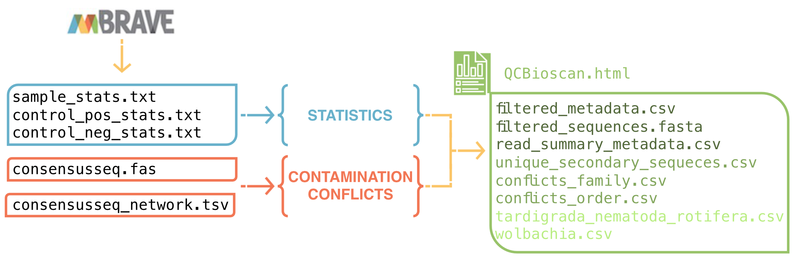

# BIOSCAN QC
This script generates a BIOSCAN QC report and filters one consensus sequence per sample using output files from mBRAVE. It is designed specifically for processing the Wellcome Sanger Institute BIOSCAN data. <br> <br> 
## Installation
No installation is required when running this script on Farm.
## Usage
Submit an interactive job request:<br>
```bash
bsub -Is -n 4 -R "select[mem>2000] rusage[mem=2000] span[hosts=1]" -M 2000 -G team222 bash
```
Set the batch number [the batch number should match the name of the input data directory]:<br>
```bash
batch="batch18"
```
Run the script:<br>
```bash
export batch_path="/nfs/users/nfs_a/aw43/aw43/2024_07_bioscan_qc/input/mbrave_batch_data/${batch}/"
export output_path="/nfs/users/nfs_a/aw43/aw43/2024_07_bioscan_qc/input/output/qc_reports/${batch}/"
export batch_no="${batch}"
module load HGI/softpack/users/aw43/aw43_bioscan-aw43_bioscan-4-aw43_bioscan-4/1
Rscript -e "rmarkdown::render(input = '/lustre/scratch126/tol/teams/lawniczak/users/aw43/2024_07_bioscan_qc/code/QCBioscan.Rmd', output_format = 'html_document', output_dir = Sys.getenv('output_path'))"
```
<br>
<p align="center">
  
</p>

## Input
The script requires the following files from the mBRAVE batch output:
<i>
<li>sample_stats.txt 
</li>
<li>control_pos_stats.txt
</li>
<li>control_neg_stats.txt
</li>
<li>consensusseq.fas
</li>
<li>consensusseq_network.tsv
</li>
</i>
<br>
The fasta file should contain all sequences, not just the consensus sequences. No filtering should be applied when downloading data from mBRAVE. The names of the downloaded files should not be altered and should contain the batch number. <br><br>
Additionally, the script automatically loads a .csv file with UMI indices from the Farm directory. <br>

## Output
The script generates the following output files:
- <i>QCBioscan.html</i><br>Main QC report with plots, tables, and statistics for the sequencing run.
- <i>filtered_metadata.csv</i><br>Metadata for samples that passed the QC. This file also contains the quality scores that each sample gets assigned [see below].
- <i>filtered_sequences.fasta</i><br>Consensus sequences for samples that passed the QC. All samples from the metadata are here, despite the quality scores. 
- <i>read_summary_metadata.csv</i><br>Summary statistics for the sequencing run. Further the tables can be combined across the batches to calculate sequencing statistics. 
- <i>unique_secondary_sequences.csv</i><br>Table of secondary sequences not found elsewhere on the partner or UMI plate [50 or more reads], retained for further secondary sequence analysis [parasites/symbionts].
- <i>conflicts_family.csv and conflicts_order.csv</i><br>Tables of secondary sequences with good read support (> 50 reads or 50% or more of the primary sequence read) that were assigned to a different taxon than the primary sequence [family or order level], for further secondary sequence analysis [parasites/symbionts].
- <i>tardigrada_nematoda_rotifera_annelida.csv and wolbachia.csv</i><br>Non-Arthropod sequences retained for further exploration. These files are not filtered for number of reads nor contain quality categories. These should be processed further if required. Vertebrates are not included in these tables. 

## Documentation
The QC process is divided into parts:<br>
1. <i>Assessment of the sequencing run</i><br>
The script evaluates the quality of the sequencing run by providing statistics for both control and sample data and quality assessments of the partner and UMI plates.<br>
Plates are flagged for further evaluation if their read counts are insufficient compared to positive controls. The 5% of positive and negative controls with the lowest performance are also identified. <br>
The QC report provides an overview of sequencing performance and highlights partner and UMI plates of lower than expected quality. However, plates are not automatically eliminated. Highlighted plates should be examined and re-sequences if required.<br>
There’s also a table of failed negative controls that can potentially contain insect samples (partner’s error) and may need to be examined. <br><br>
3. <i>Assessment of sequence conflicts and contaminants</i><br>
The script identifies and assesses potential sequence conflicts and contaminants:<br><br>
Cross-Contamination: Maps the distribution of positive control reads across plates and identifies potential cross-contamination sources in the negative controls. This step shows how far on a plate the potential contamination could spread. <br><br>
Conflicting Sequences: Identifies conflicts within a sample where secondary sequences have > 100 reads or 50% or more of the primary sequence read and returns tables listing conflicts at the family and order levels. These tables can be used to recognise samples that may have two large insects plated together (partner’s error) and true symbiont/parasite interactions.
Unique Secondary Sequences: Searches for secondary sequences with more than 50 reads that are not found elsewhere on the plate, indicating a potential true signal. These tables can be used to recognise samples that may have two large insects plated together (partner’s error) and true symbiont/parasite interactions.
Shorter Sequences: Identifies sequences shorter than expected within those without assigned taxonomy and replaces them with the closest matching longer sequence within the sample (on average 100 bp longer; Levenshtein distance < 150). <br><br>
Non-Arthropod Sequences: Replaces all primary non-Arthropod sequences with the Arthropod sequence with the highest read count. Wolbachia, Tardigrades, Rotifers, and Nematodes are retained in the output for further investigation. <br><br>
Quality Scores: Categorises all the retained samples into categories depending on read count and the level of secondary sequence contamination <ins><b>from the same family or order</b></ins>. <br>The main QC report also contains a table showing how many samples were clasified into which category. This information is also save in read_summary_metadata.csv file.

| Score | Category       | No. reads in primary | Secondary sequence assessment [the same family or order]                                | Decision                                |
|-------|----------------|----------------------|--------------------------------------------------------------|-----------------------------------------|
| <b>1</b>     | <i>Perfect</i>        | > 200                | No secondary sequence with 10 or more reads           |YES |
| <b>2</b>     | <i>Almost perfect</i> | 100-200              | No secondary sequence with 10 or more reads           |YES |
| <b>3</b>     | <i>Very good</i>      | < 100                | No secondary sequence with 10 or more reads           |YES |
| <b>4</b>     | <i>Good</i>           | > 200                | At least one secondary sequence with 10 or more reads |NO [MAYBE] |
| <b>5</b>     | <i>Ok</i>             | 100-200              | At least one secondary sequence with 10 or more reads |NO [MAYBE] |
| <b>6</b>     | <i>Almost ok</i>      | < 100                | At least one secondary sequence with 10 or more reads |NO [MAYBE] |
| <b>7</b>     | <i>Need attention</i> | NA                | Conflicts detected in previous steps                     |NO [MAYBE] |
| <b>8</b>     | <i>Exclude</i>        | < 15                  | At least one secondary sequence with 3 or reads       |NO |

3. <i>Final assessments and plots </i><br>
This part contains tables with percentages of retained samples per partner, partner plate, and UMI plate. <br>
Further, all partner plates and UMI plates are displayed as heatmaps.
